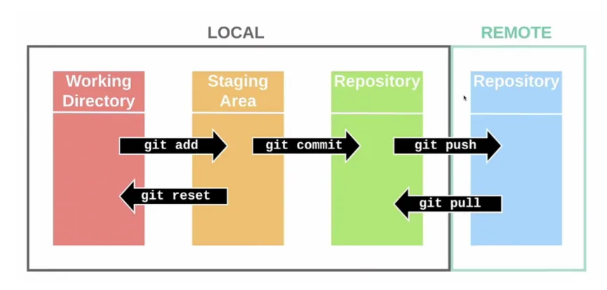
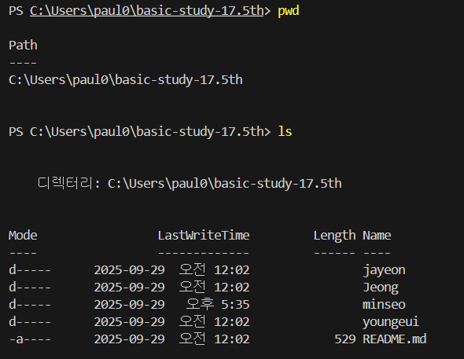
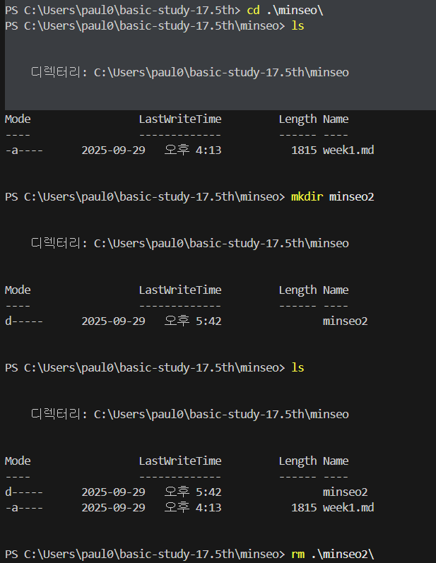

# 1주차 정리 

<h3>  개발 프로세스 </h3>

- **1.기획**
    - 기획단계(무엇을 만들지 결정)
    - **요구사항 정의서** 작성 (사용자 관점에서)
    - **기능명세서** (개발자가 구현해야 하는 기능,규칙 등 명시)
    - 디자이너-와이어프레임(기본 설계,배치도),UI/UX(디자인,경험) 시안 제작

- **2.개발** 
    - 기획단계를 토대로 코드를 구현하는 단계
    - 프론트엔드(UI / 사용자가 상호작용하는 모든 부분 구현)
    - 백엔드(서버/DB(데이터 저장,관리)/API(통신 규칙)/로직 구현)
    - GitHub 등으로 협업
- **3.배포**
    - 완성된 서비스를 **서버**에 올려 사용자의 접근 가능(URL/도메인으로 접근)
    - 프론트 엔드 / 벡앤드 각각 배포
- **4.운영&유지보수**
    - 서비스 출시 이후 사용자 서버 모니터링,피드백,버그 수정,기능 추가,장애 대응 등등

<h3>  Git/GitHub </h3>

# Git
분산 버전 관리 시스템(코드 파일 변경 이력 관리)
- 분산구조로 자신의 pc에 저장소를 가지고 중앙서버에도 저장소를 가짐
- 파일의 변경사항 저장,추적 가능 
- 특정 시점으로 되돌릴 수 있음 
- 브랜치로 작업을 분리해서 merge로 통합해서 동시에 작업가능

## Git의 기본 개념 
1. 저장소 
- Repository == '레포' > 코드와 수정기록이 저장되는 공간 

 - 자신의 pc 는 로컬 저장소 / GitHub와 같은 서버는 원격 저장소 
 - 로컬 저장소는 3가지 구역으로 나뉨.

     - **Working Directory** :  실제 파일 작업 공간
        - 우리가 보는 일반적인 프로젝트 폴더
        - 모든 파일은 Untracked / Tracked로 나뉨
        - **`git add`**  필요 (이 파일을 추적해줘 ! 라고 알리는 명령어)
    - **Stage** : 임시 저장 공간
        - “커밋 후보”를 올려두는 임시 공간
        - working directory에서 제출된 파일들의 “추적 상태”를 관리
    - **Repository**:  커밋이 실제로 기록되는 공간
         - 프로젝트의 히스토리가 모두 저장됨
2. 커밋 
     - 코드의 변경이력을 Hash값으로 인덱싱해서 진행 순서를 알 수 있게 함
    - 부모를 각 노드마다 기록
3. 브랜치
    - 독립된 작업 공간
4. 머지
    - 브랜치를 통합(결과 합치기)
5. HEAD
    - 현재 작업 중인 커밋을 가리킴
6. 파일상태흐름 
    - Untracked (추적 안 됨)
        - Git이 관리하지 않는 파일 (새로 만든 파일)
        - `git add` 명령어 → Git이 추적 시작
    - Tracked (추적 중)
        - 한 번이라도 추적된 적이 있는 파일
    - Unmodified (수정 없음)
        - 커밋 이후 해당 파일 수정하지 않은 상태
    - Modified (수정됨)
        - 커밋 이후 해당 파일 수정한 상태 (add는 안 함)
    - Staged (스테이징됨)
        - 수정한 파일을 add 해서 커밋 대기 중인 상태

# GitHub 
Git 저장소를 관리하는 클라우드 기반 협업 플랫폼

- 협업 기능 풍부
    - PR(pull request) > 내가 수정한 코드 원본 프로젝트에 반영
    - Issue(프로젝트 논의 게시판) 
    - Fork(다른 사람의 프로젝트 복제 > 실험,연습 가능) 
-

- GitHub 이외의 플랫폼 >> GITLAB(회사 자체 서버에 설치해서 보안 때문에 외부 클라우드를 못 쓰는 경우 사용) , BITBUCKET ,AWS CodeCommit, Gitea

- 자주 쓰는 Git 명령어

| 단계 | 명령어| 설명 |
| ---  | --- |  --- |
|저장소 생성| git init |현재 폴더를 Git 저장소로 초기화 (.git 폴더 생성/ Git이 관리하는 모든 데이터가 저장됨)|
|상태 확인|git status|현재 변경사항과 스테이징 상태 확인
|스테이징|git add 파일명|특정 파일 올리기
|   |git add .|모든 변경사항 한 번에 올리기
|커밋|git commit -m "메시지"|스냅샷(버전) 저장
|이력 확인|git log|모든 커밋 기록 확인
|원격 연결|git clone [URL]|원격 저장소를 내PC로 복사
|  | git remote add origin [URL] |로컬 저장소에 원격 연결 추가
|  | git remote -v |현재 연결된 원격 저장소 확인
|동기화|git push origin 브랜치명|내 브랜치→ 원격 저장소로 업로드
|  |git pull origin 브랜치명|원격 저장소의 최신 변경사항 가져오기 (merge까지됨)|
|   |git fetch 브랜치명|원격 최신 정보만 가져오기 (merge X)
|브랜치|git branch|브랜치 목록 보기
|    |git branch 브랜치명 |새 브랜치 생성
|     | git checkout -b 브랜치명|브랜치 생성 + 이동
|     |git switch 브랜치명|브랜치 이동
|    |git checkout 브랜치명|전환,생성 및 전환,변경사항 취소 등 여러 기능 담당 
|병합|git merge 브랜치명|다른 브랜치 변경사항 합치기

- git switch는 브랜치 전환,생성 및 전환에 사용하고 git checkout도 브랜치 전환,생성 및 전환 등에
사용하지만 git checkout은 전환 이외에도 다른 기능이 있어서 혼란을 유발할 수 있으므로 전환에는 switch를 사용하는 것이 좋다.

- git push origin vs git push -u origin 
  - git push -u origin 은 현재 로컬 브랜치와 원격 브랜치를 연결 시켜준다.
한번 설정해놓으면 된다.
git push origin은 추적 브랜치를 설정하지 않아 항상 브랜치를 지정해줘야 한다.

- git은 로컬에서 버전관리에 도움을 주는 도구이고 github는 git저장소를 온라인에 올려서 다른 사람과 협업하는 플랫폼

<h3>  CLI 기본 명령어 </h3>

- command line interface =터미널에서 명령어로 조작하는 방식

명령어 예시 pwd ls 
 

cd mkdir rm
 

|pwd	|현재 디렉토리 경로출력|
|---|---|
|ls	|현재 폴더 안의 파일/폴더 목록 출력|
|ls -a	|숨김파일까지 출력|
|cd 폴더명	|해당 폴더로 이동|
|cd ..	|상위 폴더로 이동|
|mkdir 폴더명|	새 폴더 만들기|
|rm 파일명	|파일 삭제|
|rm -r |폴더명	폴더 삭제 (그 안의 내용까지)|
|clear|	터미널 화면 지우기|

<h3>  Markdown </h3>

문서작성을 위한 경량 마크업(중요 표시)언어로 .md 확장자를 사용
- 마크업 문법 예시
---
** **강조** **  >> **강조**

< strong>강조< /strong>  >> <strong>강조</strong>

--- 
# 제목1 (가장 큼) << # 제목1
## 제목2 << ## 제목2
### 제목3 << ### 제목 3

---
**볼드체**  <<** 볼드체 **

*기울임체* <<* 기울임체 *
 
~~취소선~~ << ~~ 취소선 ~~

---

1. 항목1 <<1. 항목1
2. 항목2 <<2. 항목2

---
- 항목1   <<- 항목1
- 항목2   <<- 항목2
	- 항목2-1   << -항목 2-1 
	- 항목2-2   << -항목 2-2

---
> 인용문
---

|,---을 사용 

| 항목1   | 항목2   |   
| ------ | ------ |
| 내용1 | 내용2 |
| 내용3 | 내용4 |

