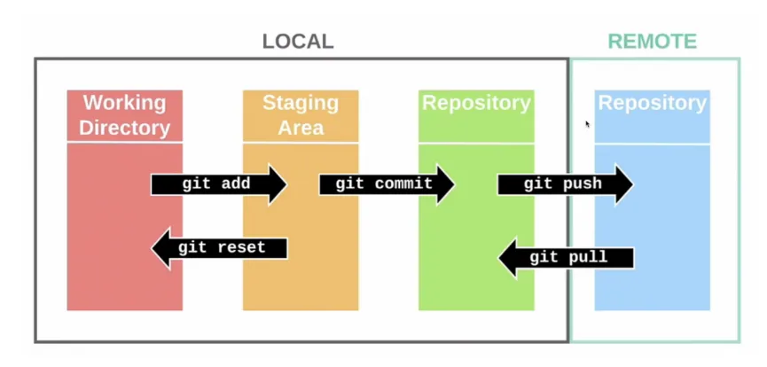

# 2주차 

<h3> 명령어 </h3>

|주제 |명령어 |핵심포인트|
|---|---|---|
|되돌리기|git reset [옵션]|과거 특정 커밋으로 상태 되돌림,옵션에 따라 다름 (--soft  커밋만 취소 변경 내용은 staging area 에 남음, --mixed 커밋,스테이징 모두 취소,변경내용 working directoryd에 남김, --hard 커밋,스테이징,working directory 변경 내용 모두 삭제)|
| |git revert <commit>|잘못된 커밋을 되돌리는 새로운 커밋 생성(기존의 커밋을 지우지 않고 새로운 기록 추가)  |
| |git restore [파일명] | 특정 파일의 변경사항만 최신 커밋 상태로 되돌림 |
|커밋 수정|git commit --amend|가장 최근에 한 커밋 수정(커밋 메세지 바꾸기,파일 추가 등),이미 push한 커밋은 불가 |
|브랜치 관리|git merge| 브랜치 합치기 |
|  |git rebase| 브랜치 시작점 다른 브랜치의 최신 커밋 위로 옮김|
|  |git cherry-pick <commit>|다른 브랜치에 있는 특정 커밋 하나만 골라서 현재 내 브랜치에 복사|
|작업 임시 저장|git stash|아직 커밋하지 않은 변경사항들을 임시로 저장|
|  |git stash pop| 숨긴 작업 꺼내기|

|reset | revert|
|---|---|
|기록 지움|새로운 기록 추가|
|위험|안전|
   
|merge | rebase |  
|---|---|
|머지 커밋 생성 |머지 커밋 비생성  |

|HEAD | Detached HEAD|
|---|---|
| 내가 작업하고 있는 위치를 가리ㅣ는 포인터(보통 브랜치의 마지막 커밋 가리키는 상태 )  |브랜치가 아닌 특정 커밋을 가리키는 상태,이 상태의 작업한 내용은 브랜치에 속하지 않으므로 주의   |

<h3> 브랜치 전략 </h3>

- 정의 
  -  여러 개발자가 하나의 저장소에 작업을 할 때 git branch 에 대한 규칙을 정하고(어떤 순서로 만들고 합칠지 등) 저장소를 잘 활용하기 위한 workflow(규칙 등)를 정의하는 것 
  - 프로그램 관리 유연성 상승,용이
  - 배포 안정성 향상
  - 여러 브랜치 전략이 있지만 대표적으로 Git Flow,GitHub Flow,Gitlab-Flow가 있다

  ## **Git Flow**
-  **브랜치종류** 
1. **master**: 제품 출시 버전을 관리하는 메인 브랜치
2. **develop**: 다음 출시 버전을 위해 개발하는 브랜치
3. **feature**: 새로운 기능을 개발하는 브랜치,후에 develop에 합쳐짐
4. **release**: 다음 출시 버전을 준비하는 브랜치,develop에서 나와 최종 테스트
5. **hotfix**: 출시된 제품의 치명적인 버그를 고치기 위한 브랜치
---
**동작과정**

1. 새로운 기능 개발을 위해 develop branch를 기준으로 하는 feature 브랜치를 따서 작업 진행
2. 작업이 완료된 feature 브랜치는 develop 브랜치로 병합 PR,REVIEW,MERGE
3. 다음 출시 버전을 위해서는 develop 브랜치에서 release 브랜치를 따서 배포준비
4. 테스트 이후, master 브랜치로 Merge 하여 제품 출시
5. 출시 이후 미발견 버그들은 hotfix branch에 반영

## **GitHub Flow**
**브랜치 종류**
1. **main(master)** :베이스 브랜치
2. **feature**:기능 브랜치 - 베이스에 기능을 추가

---
**동작과정**

1. main 에서 새로운 기능 브랜치를 만들기
2. 개발 후 PR,REVIEW,메인에 MERGE
3. 배포

## GitFlow vs GitHub Flow
|GitFlow|GitHub Flow|
|---|---|
|다양한 종류의 브랜치 사용|2가지 종류의 브랜치|
|안정적인 버전 출시|빠른 기능 개발 및 배포|
|빠른 기능 수정,배포에 유연성 떨어짐 | 테스트,검증 절차가 없어 버그 등 위험성 존재|
|체계적이고 큰 프로젝트에 적합 | 배포가 자주 일어나는 프로젝트에 적합|

<h3> GitHub 협업 </h3>

- GIT과 GITHUB를 사용하여 여러명의 개발자가 하나의 프로젝트를 '질서 있게' 만들어 나가기 위한 체계적인 업무 절차

**절차**

Issue → Branch → Commit → Push → PR → Merge

1. **Issue** : 팀 내에서 진행해야 하는 작업 (버그 수정,기능 개발 등) 논의 ,관리
2. **Branch** : 새로운 Branch를 생성해서 작업 
3. **Commit** : 변경된 코드 로컬 저장소에 저장
4. **Push** :변경된 내용을 GitHub와 같은 플랫폼의 온라인 브랜치에 업로드
5. **PR** :pull request 작업한 내용을 다른 팀원들이 review하고 메인 브랜치에 통합할 수 있도록 요청
6. **Merge** :코드 리뷰 후 승인이 완료되면 원본 프로젝트에 작업내용을 추가

- Merge를 할 때 4가지 전략:Fast-forward, 3-way, Squash, Rebase
Merge

1. **3-way merge** : 가장 기본적인 merge방법, 
각 브랜치에 신규 commit이 있는 경우 새로운 commit을 생성하면서 내용을 합침.  
- 누가 언제 어디서 작업했는지 등을 볼 수 있음  
- 나중에 복잡해질 수 있음 

2. **Fast-forward**
새로운 브랜치에만 commit이 있고 기준 브랜치에는 commit이 없을 때 새로운 브랜치가 기준 브랜치가 자동으로 된다.

  
>git branch -d 브랜치이름 :병합 완료된 브랜치 삭제  
git branch -D 브랜치이름 :병합 하지 않은 브랜치 삭제

3. **Rebase**
브랜치의 시작점을 다른 commit으로 옮긴다.
\>이후 fast-forward merge를 진행하면 한 줄로 합쳐진다.
- 깔끔하게 확인 가능
- 충돌 등 조작 위험 있음
> git switch 새로운 
브랜치  
git rebase main   //충돌이 날 수 있다   
git switch main   
git merge 새로운 브랜치

4. **Squash**
모든 브랜치를 3way-merge하면 매우 복잡해질 수 있기 때문에 합치고자 하는 브랜치를 합쳐서 선으로 잇지 않고 메인 브랜치로 이동,merge된 브랜치의 commit들은 출력되지 않는다. 
- 깔끔하게 확인 가능
- 과정 기록 손실
>git switch main  
git merge --squash 브랜치명  
git commit 

-**이러한 merge 방법들은 메뉴얼로 구성되있는 경우도 있으며 상황에 따라 올바른 merge방법을 사용하여야 한다.**

<h3> 충돌(Conflict) </h3>

- **충돌**은 Git이 두 개의 다른 브랜치를 자동으로 Merge할 수 없을 때 발생하는 문제. Git이 "어떤 것을 선택해야 할지 몰라서" 개발자에게 직접 결정을 내려달라고 요청하는 것
- 다른 브랜치에서 같은 라인등을 서로 다르게 수정했을 때 발생

- **충돌 수정** 
  - **1.충돌 확인** :Git 이 충돌이 발생한 파일을 명시 (vscode에서는 터미널 등에서)
  - **2.충돌 해결** :해당 파일을 열면 Git이 어느 부분에서 충돌이 발생했는지 특수기호로 표시
  ><<<<<<< HEAD  
  HEAD 내용  
  ======  
  feature 내용  
  \>>>>>>> feature

     자동 해결 :(vs code 같은 경우 무엇을 남길지 선택하는 버튼 제공)  
      수동 해결 :(특수기호 제거 후 코드 수정)
  - **3.저장 후 커밋**
   >git add .  
    git commit
---

  > merge 이전 상태로 돌아가고 싶을 때는   
  git merge —abort

<h3> 커밋 컨벤션 </h3>

- commit 메세지를 어떤 형식으로 쓸지 팀원과 함께 사전에 정한 규칙
>commit -m "메세지부분"

- 팀원간 소통을 원할,가독성 향상,자동화 등을 위해 메세지를 어떻게 보내는 것이 중요
- 여러 대표 커밋 컨벤션 (udacity style,angular style 등)이 있다.

여러 구조가 있지만 대부분 크게   **type  scope  body   subject footer** 등으로 구분   
**type** :메세지 타입   
ex
>fit:새로운 기능  
fix:버그 수정 

**scope**: 어디를 수정했는가? 
ex
> (login)
 (api)

**subject** :제목 (명령문 사용,마침표 금지,대문자로 시작 등의 규칙이 있다)

**body** :부연설명(선택사항)

**footer** :꼬리말(선택 사항) 이슈 트래커(Issue Tracker) ID를 참조할 때 사용
>Fixes: #123

예시 
>git commit -m "fix(api): Correct user authentication error"

