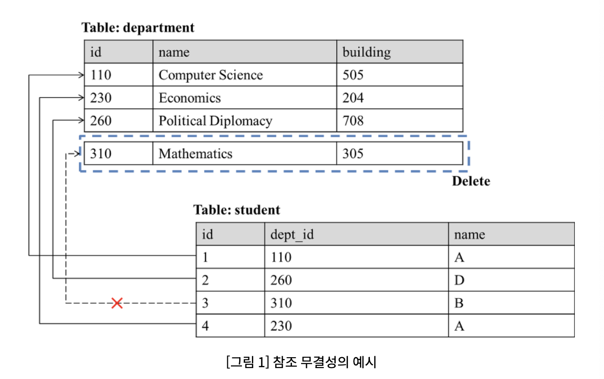
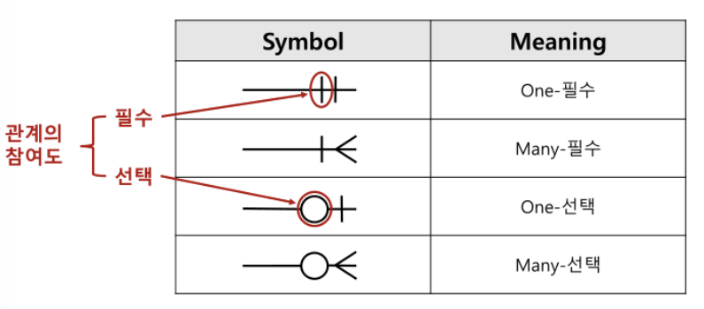
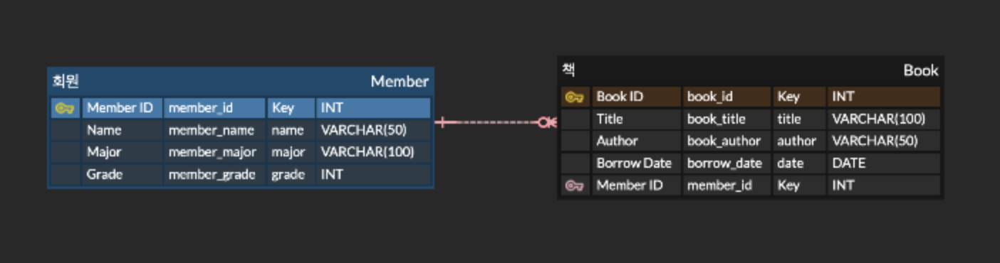

# week7 내용 발표 자료

### 1. 데이터베이스

- **데이터베이스 (Database, DB)**
    
    **: 여러 사람이 공유하고 사용할 목적으로 체계적으로 수집, 조직, 저장된 데이터의 집합**
    
    - 필요성
        
        **데이터베이스가 없다면,**
        
        - 데이터 중복 : 저장 공간 낭비
        - 데이터 불일치
        - 데이터 공유의 어려움 : 여러 사용자가 동시에 동일한 데이터에 접근하고 수정하기 어려움
        - 보안 및 무결성 문제 : 데이터가 유실되거나 잘못된 값이 입력되는 것을 막기 어려움
        
        **⇒ 이러한 문제들을 해결하고 데이터를 효율적이고 안전하게 관리하기 위해 필요**
        
    - 특징
        - **실시간 접근성** : 사용자가 데이터를 요청하면 즉시 처리하여 결과 반환
        - **동시 공유** : 여러 사용자가 동시에 같은 데이터에 접근하여 사용 가능
        - 계속 변화 : 정적인 상태가 아닌 새로운 데이터가 처리되며 항상 **최신 상태 유지**
        - **내용에 의한 참조** : 데이터를 찾을 때 내용(값)을 기반으로 찾기 가능
        
- **DB 종류**
    1. **관계형 데이터베이스 (Relational DB)**
        - **테이블 형태**(행과 열)로 데이터를 저장
        - 데이터의 일관성, 무결성, 중복 최소화 보장
        - SQL을 사용하여 데이터 조작
    2. **비관계형 데이터베이스 (NoSQL)**
        - **비정형 / 반정형 데이터**를 저장
        - 수평 확장에 유리 → DB 처리 능력 향상
        - 빠른 속도와 유연성
    3. **문서형 데이터베이스**
        - NoSQL의 한 종류
        - JSON, XML과 유사한 문서 형태로 데이터 저장
    4. **키-값 데이터베이스**
        - 단순한 key-value의 쌍으로 데이터 저장
    5. **그래프 데이터베이스**
        - 데이터를 노드와 간선으로 표현하여 **관계 중심의 데이터** 저장
        - SNS, 추천 시스템 등 관계 기반 서비스에 적합
        
- **DBMS (Database Management System)**
    
    **: 데이터베이스를 효율적이고 안전하게 관리할 수 있도록 도와주는 소프트웨어**
    
    - 역할
        - 데이터 정의 : DB의 구조(테이블, 데이터 타입 등)을 생성하거나 수정, 삭제
        - 데이터 조작 : 사용자가 원하는 데이터를 검색, 삽입, 수정, 삭제 (CRUD) 기능 제공
        - 데이터 제어
            - 보안 : 사용자별 접근 권한 설정
            - 동시성 제어 : 여러 사용자가 동시에 작업에도 데이터의 무결성 유지
            - 장애 복구 : DB에 문제가 생겼을 때 데이터 백업 및 복구
    
    <aside>
    💡
    
    DB는 데이터를 저장하는 곳
    
    DBMS는 그 데이터를 관리하고 조작하는 프로그램
    
    </aside>
    

### 2. SQL

- **SQL (Structured Query Language)**
    
    **: 관계형 데이터베이스에 정보를 저장하고 처리하기 위한 프로그래밍 언어**
    
    - 사용자가 DBMS와 소통할 때 사용하는 언어 → 사용자가 SQL로 명령을 내리면 DBMS가 이를 해석하여 데이터를 처리
    - 기본 문법
        1. **DDL (Data Definition Language)**
            - 데이터베이스 구조 정의 (테이블 생성, 수정, 삭제)
            - ex. `CREATE`, `ALTER`, `DROP`
            - 예시 쿼리문
                
                ```sql
                -- 학생 정보를 저장할 테이블 생성
                -- 3개의 열을 가진 Student 빈 테이블 생성
                CREATE TABLE Student (
                		id INT PRIMARY KEY -- 정수형, 기본 키로 지정
                		name VARCHAR(50) -- 문자열
                		major VARCHAR(30)
                );
                
                -- Student 테이블에 age 열 추가
                ALTER TABLE Student
                ADD age INT;
                ```
                
        2. **DML (Data Manipulation Language)**
            - 데이터 조회, 추가, 수정, 삭제
            - ex. `SELECT`, `INSERT`, `UPDATE`, `DELETE`
            - 예시 쿼리문
                
                ```sql
                -- SELECT
                SELECT 열 FROM 테이블 WHERE 조건식;
                SELECT * FROM Student; -- 모든 학생의 모든 열(*)을 조회
                SELECT name, major FROM Student WHERE age >= 20; -- 나이가 20 이상인 학생의 이름과 전공만 조회
                
                -- INSERT
                INSERT INTO Student (id, name, major, age)
                VALUES (1, '송영의', '컴퓨터공학과', 20);
                
                -- UPDATE
                UPDATE Student
                SET major = '경영학과'
                WHERE id = 1; -- id가 1인 학생의 전공을 경영학과로 변경
                
                -- DELETE
                DELETE FROM Student
                WHERE age < 19; -- 나이가 19세 미만인 학생의 정보 삭제
                ```
                
        3. **DCL (Data Control Language)**
            - 데이터베이스 접근 권한 관리
            - ex. `GRANT` (권한 부여), `REVOKE` (권한 취소)
            - 예시 쿼리문
                
                ```sql
                -- user1에게 Student 테이블의 SELECT 권한 부여
                GRANT SELECT ON Student To user1;
                ```
                
        4. **TCL (Transaction Control Language)**
            - 트랜잭션을 다루는 SQL 명령어
            - ex. `COMMIT` (작업 확정), `ROLLBACK` (작업 취소)
            - 예시 쿼리문
                
                ```sql
                BEGIN TRANSACTION; -- 트랜잭션 시작 선언 (임시 편집 시작)
                
                UPDATE Student SET age = 21 WHERE id = 1; -- 작업 후 (트랜잭션 안에서) 임시 반영
                DELETE FROM Student WHERE id = 2; -- 작업 후 (트랜잭션 안에서) 임시 반영
                
                COMMIT; -- 실제 DB에 반영
                -- 만약 COMMIT 전에 오류가 발생하면,
                -- ROLLBACK을 통해 트랜잭션 시작 전 상태로 복구 (아무 일도 없었던 것처럼)
                ```
                
            
- **트랜잭션 (Transaction)**
    
    **: 여러 개의 SQL 작업을 하나의 묶음 단위로 처리하는 개념**
    
    - 특성 (ACID)
        1. 원자성 (Atomicity) : 모두 실행되거나, 아예 실행되지 않음
        2. 일관성 (Consistency) : 실행 전후, 데이터의 규칙이 유지되어야 함
        3. 독립성 (Isolation) : 동시에 실행돼도 서로 간섭하지 않음
        4. 지속성 (Durability) : 완료된 결과는 시스템이 꺼져도 유지
    
    <aside>
    💡
    
    데이터 변경 작업을 안전하게 묶어서, 성공하면 확정, 실패하면 되돌리는 SQL 기능
    
    </aside>
    
- **무결성 (Integrity)**
    
    **: 데이터가 정확하고 일관되도록 유지하는 규칙 → DB에 결점 없는 데이터를 유지하기 위한 규칙**
    
    - 제약 조건
        - **개체 무결성** (Entity Integrity) : 모든 테이블이 기본 키로 선택된 필드를 가져야하고, 이는 고유한 값을 가지며 Null 값이 올 수 없음
            - `id INT PRIMARY KEY`
        - **참조 무결성** (Referential Integrity) : 참조 관계에 있는 두 테이블의 데이터가 항상 일관된 값을 갖도록 유지되는 것
            - `FOREIGN KEY (dept_id) REFERENCES department(id)`
            
            
            
        - **도메인 무결성** (Domain Integrity) : 테이블의 특정 열에 입력될 수 있는 값의 범위나 유형 제한
            - `CHECK (age ≥ 0)`
        - **고유 무결성** (Unique Integrity) : 기본 키는 아니지만, 테이블 내에서 항상 고유한 값을 가져야 하는 열에 대한 제약
            - `email VARCHAR(50) UNIQUE`

### 3. ERD

- **ERD (Entity-Relationship Diagram)**
    
    **: 데이터베이스의 구조를 시각적으로 표현한 다이어그램**
    
    - 구성요소
        - **엔티티** (Entity) : 데이터로 관리할 대상 (Table)
        - **속성** (Attribute) : 엔티티의 특징 또는 정보 (Column)
        - **관계** (Relationship) : 엔티티 간의 연관성 (Cardinality)
            - 1:1 (일대일) : 한 엔티티가 다른 엔티티의 하나와만 연결
            - 1:N (일대다) : 한 엔티티가 여러 엔티티와 연결
            - M:N (다대다) : 여러 엔티티가 여러 엔티티와 연결 → 중간 테이블(교차 엔티티)로 나누어 1:N, N:1 형태로 변환
            
            
            
    
- **정규화 (Normalization)**
    
    **: 데이터베이스를 설계할 때 데이터의 중복을 최소화하고 데이터 무결성을 높이기 위한 과정 → 테이블을 잘게 쪼개는 과정**
    
    - 정규화가 필요한 이유
        1. 삽입 이상 : 어떤 해당 정보만 추가하기 어려움
        2. 갱신 이상 : 수정할 시 모든 행을 업데이트해야 함
        3. 삭제 이상 : 한 정보만 삭제해도 모든 정보가 삭제될 위험이 있음
    - 정규화 단계
        - 1NF (제1정규형) : 반복되는 속성 제거 (각 column은 하나의 값만 가지며, 반복 속성 없음)
        - 2NF (제2정규형) : 부분 함수 종속 제거
        - 3NF (제3정규형) : 이행적 종속 제거 (A→B, B→C가 성립할 때, A→C가 성립하는 것)
    - 키 : 테이블 내의 각 행을 고유하게 식별하기 위한 속성의 집합
        - 슈퍼키 : 튜플을 유일하게 식별할 수 있는 속성들의 집합
        - 후보키 : 슈퍼키 중 최소성을 만족하는 키 (기본키가 될 수 있는 후보)
        - 기본키 (PK) : 여러 후보키 중 하나를 대표로 선택하는키
        - 대체키 : 기본키로 선택되지 않은 나머지 후보키
        - 외래키 (FK) : 다른 테이블의 기본키를 참조하는 속성
        - 복합키 : 두 개 이상의 속성을 합쳐서 하나의 기본키를 생성

### 4. 실습

- ERD

    